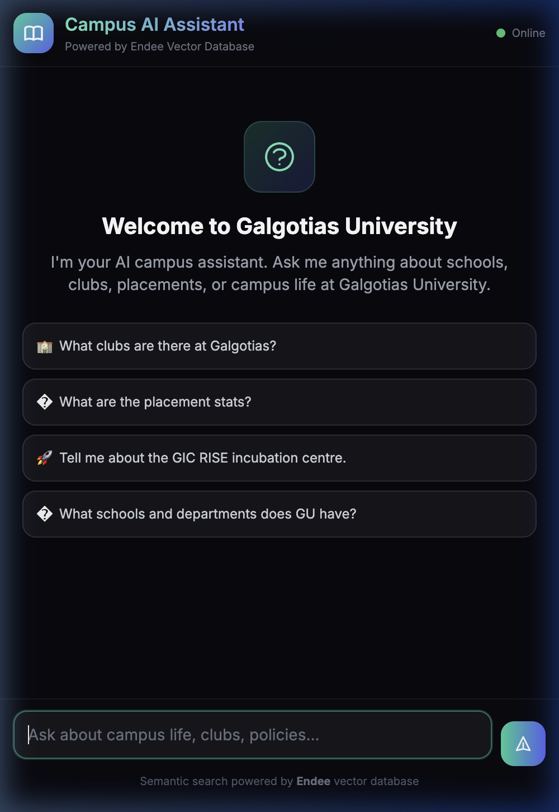

# Campus AI Assistant

A RAG (Retrieval-Augmented Generation) chatbot for Galgotias University that answers questions about campus life, clubs, placements, and policies.

Built with **[Endee](https://endee.io)** as the vector database backend.



## How it works

```
User question
    ↓
Embed with sentence-transformers (all-MiniLM-L6-v2)
    ↓
Search Endee for similar document chunks
    ↓
Filter + deduplicate results
    ↓
Build response from matched content
```

The app loads `.txt` files from `data/`, chunks them with sentence-aware splitting, generates embeddings locally, and stores them in Endee. When a user asks a question, it embeds the query, runs cosine similarity search, and returns the most relevant information.

No external LLM API keys needed — everything runs locally.

## Setup

```bash
# install dependencies
pip install -r requirements.txt

# start the server
python backend/main.py
```

Open http://localhost:8000 in your browser.

If Endee isn't running, the app automatically falls back to an in-memory numpy-based vector store.

## Project structure

```
campus-ai-assistant/
├── backend/
│   ├── __init__.py
│   ├── main.py             # FastAPI server + routes
│   ├── rag_pipeline.py     # chunking, querying, response gen
│   ├── embeddings.py       # sentence-transformers wrapper
│   └── vector_store.py     # Endee + in-memory fallback
├── frontend/
│   ├── index.html          # chat UI
│   ├── styles.css          # custom styles
│   └── chat.js             # client-side logic
├── data/
│   ├── university_info.txt
│   ├── campus_clubs.txt
│   ├── events.txt
│   └── policies.txt
└── requirements.txt
```

## API

| Endpoint | Method | Description |
|----------|--------|-------------|
| `/api/health` | GET | Health check |
| `/api/stats` | GET | Pipeline stats |
| `/api/chat` | POST | Send a question, get an answer |

**POST /api/chat** expects:
```json
{ "question": "What clubs are there?" }
```

## Config

All optional, set via environment variables:

| Variable | Default | Description |
|----------|---------|-------------|
| `ENDEE_URL` | `http://localhost:8080/api/v1` | Endee server URL |
| `EMBEDDING_MODEL` | `all-MiniLM-L6-v2` | Sentence-transformer model |
| `CHUNK_SIZE` | `500` | Max chars per chunk |
| `CHUNK_OVERLAP` | `80` | Overlap between chunks |
| `SIMILARITY_THRESHOLD` | `0.25` | Min similarity score |
| `PORT` | `8000` | Server port |

## Tech stack

- **Backend**: Python, FastAPI, uvicorn
- **Embeddings**: sentence-transformers (runs on CPU/MPS/CUDA)
- **Vector DB**: Endee (with numpy fallback)
- **Frontend**: HTML, Tailwind CSS, vanilla JS
